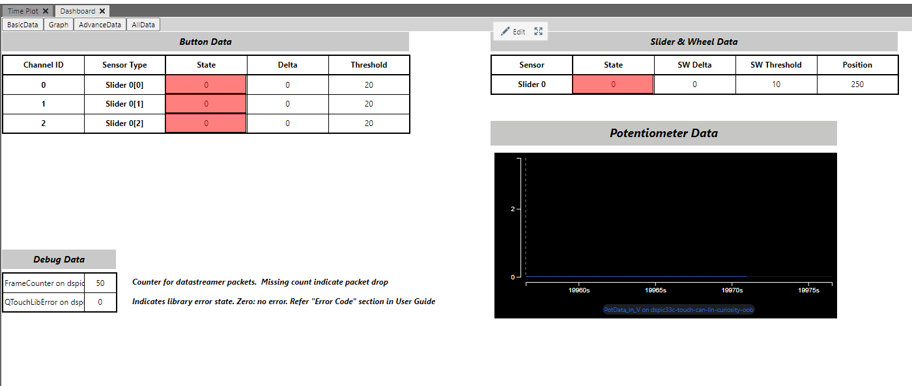
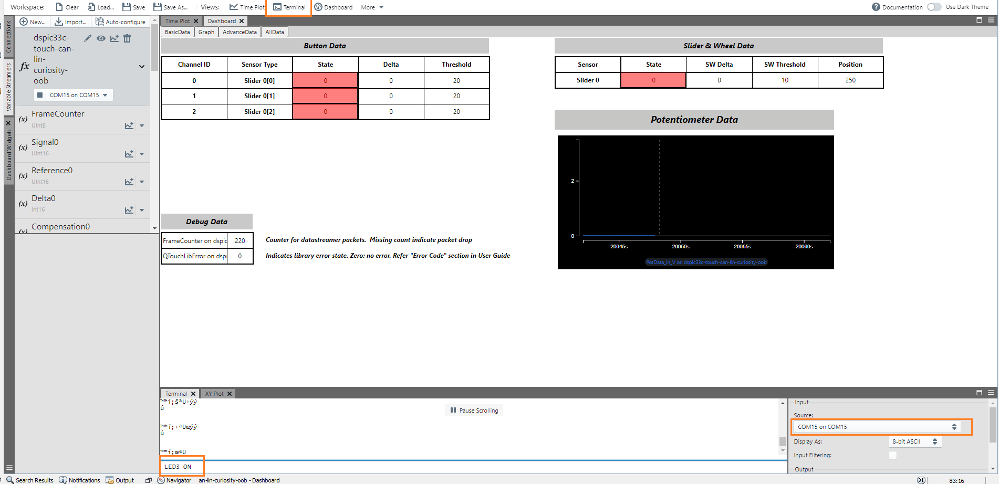

## dsPIC33C Touch CAN LIN Curiosity Development Board - Touch UART OOB Demo

## Summary

This project demonstrates the touch functions on dsPIC33C Touch CAN LIN Curiosity Development Board using MCC- Melody driver code and Touch library.

Demo code will indicate the touch position of the slider via on-board general purpose LEDs. LED1 switches on when the left most slider is pressed. LED 2-3-4-5 switches on as the touch moves towards right. Touch position is also transferred via UART to data visualizer.

The on-board potentiometer position is transferred to data visualizer.

On board general purpose LEDs can also be controlled by sending commands via Data visualizer.

## Related Documentation

[dsPIC33CK1024MP710 datasheet](https://www.microchip.com/dsPIC33CK1024MP710) for more information or specifications.

## Software Used

- [MPLAB® X IDE v6.05](https://www.microchip.com/mplabx) or newer
- [MPLAB® XC16 v2.00](https://www.microchip.com/xc16) or newer
- Device Family Pack : dsPIC33CK-MP_DFP v1.10.341
- [MPLAB® Code Configurator (MCC) 5.2.2](https://www.microchip.com/mcc) or newer
- [MPLAB® Data Visualizer v1.3.1320](https://www.microchip.com/en-us/tools-resources/debug/mplab-data-visualizer) or any other serial terminal

## Hardware Used

- [dsPIC33C Touch CAN LIN Curiosity Development Board](https://www.microchip.com/EV97U97A)

## Setup

**Hardware Setup**

- Connect micro-USB cable to port `J1` of Curiosity board to PC for viewing debug messages.

**MPLAB® X IDE Setup**

- Open the `dspic33c-touch-can-lin-curiosity-touch-uart-oob-demo.X` project in MPLAB® X IDE
- Build and program the device

**Data Visualizer Tool Setup**

- Open standalone or plugin of MPLAB® Data Visualizer
- Select `Variable Streamers` at the left most tabs 
  
- Click on `Import` at the top left corner, navigate to `dspic33c-touch-can-lin-curiosity-touch-uart-oob-demo.X\mcc_generated_files\touch\data_streamer` and select the `03EB00000000000000AA5501.ds` file 
  
- Once the file is opened, a properties window pops up listing the variables. These variables are streamed out from the device to the data visualizer via UART. Click on Save 
  
- Once the board is connected to PC, select the appropriate COM source of data streamer under `fx` dropdown. 
  
- As soon as the COM port selected the data visualizer will switch to dashboard view which looks like the one shown below 
  
- Select `Terminal` view on the toolbar and choose the same COM port as above for sending commands to the device via UART.

## Operation

- When the touch position is at the left most part of the slider, LED1 turns on as the touch of the slider is moved towards right LED2-3-4-5 turns on sequentially. When touch slider is moved from right most to left most these are turned off sequentially.
- The status of various parameters of touch such as button status and slider position can be seen on the basic view, user can switch to `Graph` tab and `AdvanceData` tab for more detailed view of touch.
- The on-board potentiometer position can also be shown as progress bar in `BasicData` view as well as `AllData` view.
- On-board LEDs can also be controlled from `Line input` of `Terminal` window by sending commands in the format `LEDx ON` or `LEDx OFF` then pressing the `Enter` key. (E.g. LED1 ON\<Press Enter Key\>) 
  

## MCC settings for reference

This Project uses the driver code generated by **MCC-Melody**.

**ADC Configuration (Potentiometer)**

- ADC Configuration done in MCC Melody User Interface for potentiometer handling in this demo.  
  

**PIN Configuration**

- UART pins configuration in Pin Grid View: RB14 as UxTX, RB15 as UxRX 
  
- LED pins configuration in Pin Grid View: RE6, RE7, RE8, RE9 and RF11 as GPIO Output 
  
- Pins Table view configurations: Custom name of RE6 to `led1`, RE7 to `led2`, RE8 to `led3`, RE9 to `led4` and RF11 to `led5` 
  

**Timer for Input Command Timeout**

- Timer configuration for serial command timeout. 
  
